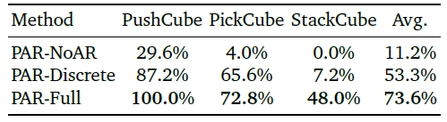

<!--  -->

# Physical Autoregressive Model for Robotic Manipulation without Action Pretraining
This is the official PyTorch implementation of **Physical Autoregressive Model for Robotic Manipulation without Action Pretraining**

[📘paper](https://arxiv.org/abs/2508.09822) |

## Abstract
The scarcity of manipulation data has motivated the use of pretrained large models from other modalities in robotics. In this work, we build upon autoregressive video generation models to propose a Physical Autoregressive Model (PAR), where physical tokens combine frames and actions to represent the joint evolution of the robot and its environment. PAR leverages the world knowledge embedded in video pretraining to understand physical dynamics without requiring action pretraining, enabling accurate video prediction and consistent action trajectories. It also adopts a DiT-based de-tokenizer to model frames and actions as continuous tokens, mitigating quantization errors and facilitating mutual enhancement. Furthermore, we incorporate a causal mask with inverse kinematics, parallel training, and the KV-cache mechanism to further improve performance and efficiency. Experiments on the ManiSkill benchmark show that PAR achieves a 100% success rate on the PushCube task, matches the performance of action-pretrained baselines on other tasks, and accurately predicts future videos with tightly aligned action trajectories. These findings underscore a promising direction for robotic manipulation by transferring world knowledge from autoregressive video pretraining.

---

  

  <em>Fig 1: The illustration of Physical Autoregressive Model.</em>

---

## Experimental Results
We use the ManiSkill Benchmark and follow prior works by evaluating the single task scenarios. We specifically focus on three manipulation tasks: PushCube, PickCube, and StackCube. We render 1K demonstrates for each task as training data. Our method achieves the second-best success rate, surprising the ICRT (Fu et.al 2025), only behind RDT (Liu et.al 2024). It is worth noting that RDT require extensive action pretraining, while our method does not.

The ablation study compares PAR-Full against two ablated variants: (1) PAR-NoAR, which removes the autoregressive architecture. (1) PAR-Discrete, which replaces the generative de-tokenizer with a discriminative one. PAR-Full consistently outperforms both baselines by a large margin, confirming the effectiveness of our designs.

---

  

  

## Detailed code coming soon